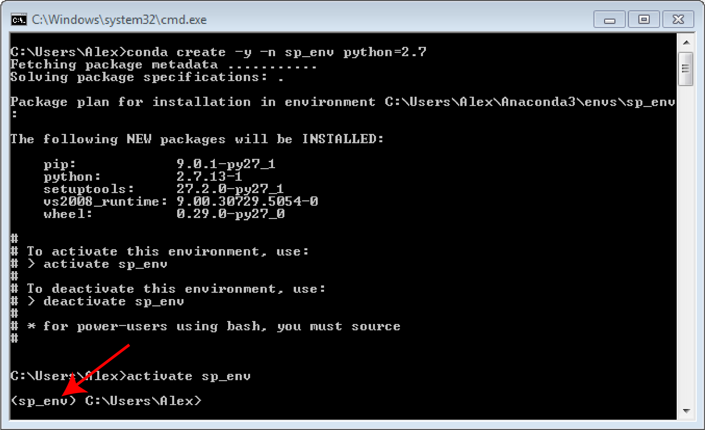
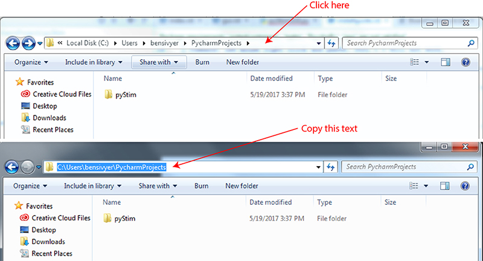

Install walkthrough
===================

The following instructions are for Windows machines. The instructions are mostly similar for OSX, except for the
wxpython install. See the wxpython site for details.

Setting up environment
----------------------

The following walkthrough uses Anaconda, a Python environment manager. Unless otherwise noted, leave options as defaults.

Enter lines of code in the terminal/command line. To open the terminal/command prompt, hit
windows + r, and enter "cmd". **NOTE** to paste text copied from this guide into the terminal
command: use mouse right click and paste. Ctrl + v will not work.

For windows, a cmd file is included in the repository that will run all the steps for you after 1 & 2. It still requires
you to manually install Anaconda and Git first. Download the cmd file by itself and then run it.

1. Install `Anaconda <https://www.continuum.io/anaconda-overview>`_ (environment manager) for python 3.6 to your user folder. Make sure to select the option to add conda to your PATH variable.
2. Install `Git <https://git-scm.com/downloads>`_ (version control tool). Make sure to select the option to add conda to your PATH variable ("Run Git from Windows Command Prompt").
3. Create the python environment for the pyStim by entering the following text into the terminal command. ::

    conda create -y -n sp_env python=2.7

4. Activate the newly created environment by entering the following code: (**NOTE** You know you will have successfully created and entered the environment when it prefixes the current path). ::

    activate sp_env

5. Install the packages included with conda: (**NOTE** this may take up to several hours, wait while the underscore is blinking). ::

    conda install -y numpy scipy Pillow matplotlib pandas pyopengl lxml openpyxl configobj sortedcontainers

6. Install the packages not included with conda. If you run into any problems here, simply close the command window, reopen it then reactivate the env. ::

    pip install tabulate igor tqdm moviepy pyglet psychopy labjackpython pyusb pycrafter4500 json_tricks

7. Install wxpython (gui interface). ::

    conda install -y -c anaconda wxpython=3.0.0.0

8. (OPTIONAL) If you wish to be able to save captures of your stims, install ffmpeg. ::

    conda install -y -c conda-forge ffmpeg=3.2.4

9. (OPTIONAL) If you wish to be able to playback movies, install avbin from this site. ::

    http://avbin.github.io/AVbin/Download.html

10. Navigate to where you want to save the pyStim repository. ::

    cd "C:/your/location/of/choice"

For example C:/Users/bensivyer/PycharmProjects

To copy the path location: go to your desired folder in Windows and click to the right of the foldername in the search bar
and simply paste this text after "cd" in the terminal command

.. image:: ../screenshots/Terminal_command.jpg
    :width: 800 px

11. Download the repository (a new repositry folder will be automatically created). ::

    git clone https://github.com/SivyerLab/pystim.git

12. Navigate into the pyStim folder and code folder. ::

    cd pyStim/pyStim

13. Run the pyStim GUI.

.. code-block:: doscon

    python pyStimGUI.py

14. If want to trigger an external device using a labjack install the labjack driver from the labjack site: `Labjack driver instructions <https://labjack.com/support/software/examples/ud/labjackpython>`_.
Make sure to run the install steps within the conda environment
