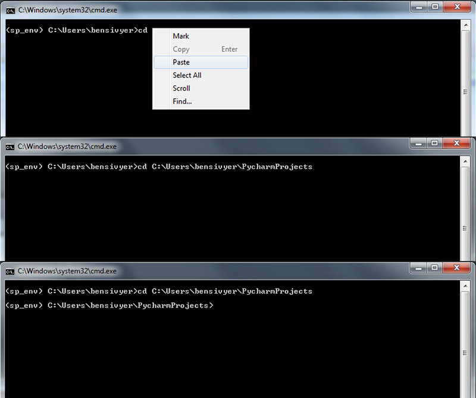

Install walkthrough
===================

The following instructions are for Windows machines. The instructions are mostly similar for OSX/Linux. If you run into
a problem with installing wxPython, please see the wxPython `website<https://www.wxpython.org/>`_ for help.

Setting up environment
----------------------

The following walkthrough uses pipenv, an all in one Python environment manager. Unless otherwise noted, leave options
during install as defaults.

Enter lines of code in the terminal/command line. To open the terminal/command prompt, hit windows + r, and enter "cmd".
**NOTE** to paste text copied from this guide into the terminal command: use mouse right click and paste. Ctrl + v will
not work.

1. Install `Python 3.6<https://www.python.org/downloads/>`_.

2. Install `Git<https://git-scm.com/downloads>`_ (version control tool). Make sure to select the option to add git to
your PATH variable ("Run Git from Windows Command Prompt").

3. Navigate to where you want to save the pyStim repository. ::

    `cd "C:/your/location/of/choice"

For example C:/Users/bensivyer/PycharmProjects

To copy the path location: go to your desired folder in Windows and click to the right of the foldername in the search
bar and simply paste this text after "cd" in the terminal command.

4. Download the repository (a new folder called pystim will be automatically created). ::

    git clone https://github.com/SivyerLab/pystim.git

5. Install pipenv. ::

    pip install pipenv

6. Create the python environment for pystim and automatically install all the necessary packages by entering the
following text into the terminal command. ::

    pipenv install --skip-lock

7. (OPTIONAL) If you wish to be able to save captures of your stims, install ffmpeg.

8. (OPTIONAL) If you wish to be able to playback movies, install `avbin<http://avbin.github.io/AVbin/Download.html>`_.

9. Run the pyStim GUI. ::

    pipenv run python pyStim/pyStimGUI.py

10. If want to trigger an external device using a labjack install the labjack driver from the labjack site:
`Labjack driver instructions <https://labjack.com/support/software/examples/ud/labjackpython>`_. Then install the
labjack package. ::

    pipenv run pip install git+https://github.com/labjack/LabJackPython.git
