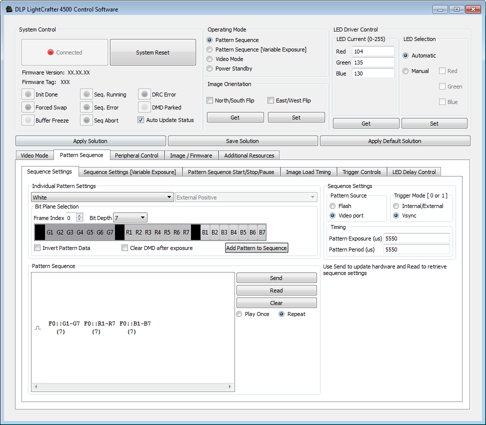
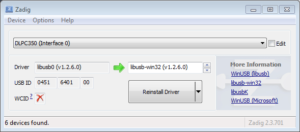
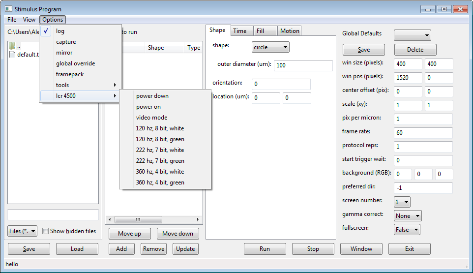
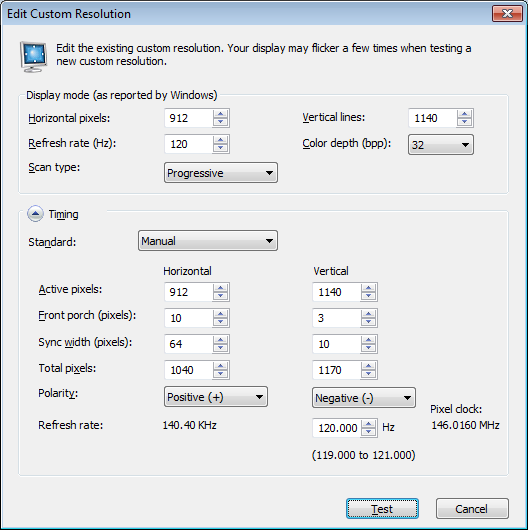
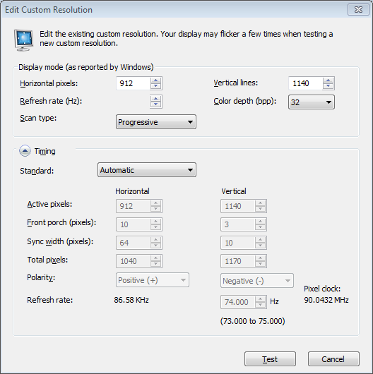

LCR 4500 quick setup
====================

Instructions for 180 hz stimuli

Description
-----------
Using the framepacking capabilities of the lightcrafter 4500, we are able to display stimuli at speeds greater than 60 hz. This is done by replacing the individual RGB planes of a single frame with 3 separate monochrome frames, thus tripling the effective frames per second coming out the projector.

Requirements
------------
* `DLP LightCrafter 4500 Development Module <http://www.ti.com/tool/dlplcr4500evm>`_ (LCR 4500)
* Power supply for LCR 4500 (see LCR 4500 page for recommendations)
* Appropriate connectors:
    * Male mini USB to male USB
    * Male mini HDMI to male HDMI
* Computer with sufficient CPU/GPU specs
* LCR 4500 GUI (available from the LCR 4500 page above)
* Stimulus software (`pyStim <https://github.com/SivyerLab/pyStim>`_)

Instructions for GUI
--------------------
1. Connect the LCR 4500 to the power supply. It should power on and start working.
2. Connect the USB and HDMI inputs between the computer and LCR.
3. Install the LCR 4500 GUI and run it. The GUI should find and connect to the LCR automatically.
4. Set the resolution of the LCR to 912 x 1140, with the frequency set to 60 hz.
5. In the GUI, change the LCR to pattern sequence mode, and set up a pattern sequence with the parameters from screenshot below.
6. Press “Send”, then “Validate”, then “Play”. The LCR 4500 should now be unpacking each frame into three separate monochrome frames, running at 180 hz.

Instructions for API control
----------------------------
1. Connect the LCR 4500 to the power supply. It should power on and start working.
2. Connect the USB and HDMI inputs between the computer and LCR.
3. Download the Zadig utility to install the libusb-win32 driver (`Zadig <http://zadig.akeo.ie/>`_)
4. In Zadig, under "Options", enable "List All Devices". You should now see "DLPC350 (Interface 0) as a device. Select that one.
5. Where it says "WinUSB", to the right of the green arrow, scroll up until you select "libusb-win32".
6. Press reinstall driver. If you had previously been using the GUI, it will no longer work.

7. You can now use the "Options/lcr 4500" commands from the menu bar. Whichever frequency you select, the video card needs to be set to 1/3 that frequency for the LCR4500. We have attached the necessary parameters for some of the higher frequencies.

**NOTE**: In some cases, if toggling between "video mode" and a pattern mode, due to a bug you will need to set the pattern mode twice. Going between pattern modes does not require this. Be sure to power up the device if it is powered down.

If you wish to return to using the GUI, this can be done by uninstalling the libusb driver through (in Windows) device manager. Be sure to select the option to "Delete the driver software".

Custom resolution settings
--------------------------

